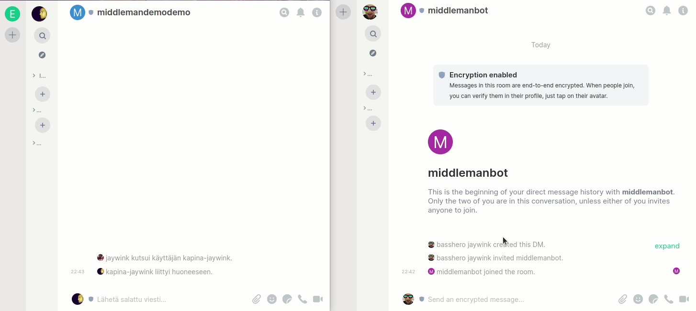

# Feedback-Bot (Fork of [Middleman](https://github.com/elokapina/middleman)) 

 

Feedback system for Matrix Synapse Element based on anonymized support-bot.

Features:

* Messages to bot are relayed to management room
* Management room users can reply by replying to the messages prefixing with `!reply`
* Sender messages can be configured as anonymous
* Configurable welcome message when bot is invited to a room
* Users in the management room can write to rooms the bot is in via the `!message` command

## Getting started

See [SETUP.md](SETUP.md) for how to setup and run the project.

## Usage

The configured management room is the room that all messages feedback_bot receives in other rooms 
will be relayed to.

Normal discussion can happen in the management room. To create a ticket for a user for further communication you can either:

* Reply to the user message with `!raise <Ticket Name>` - a ticket room for that user will be created and staff invited to it, where normal discussion can continue.
* Create a ticket room with `!c raise @user:server <Ticket Name>` - will create a ticket for the specified user.

## License

Apache2